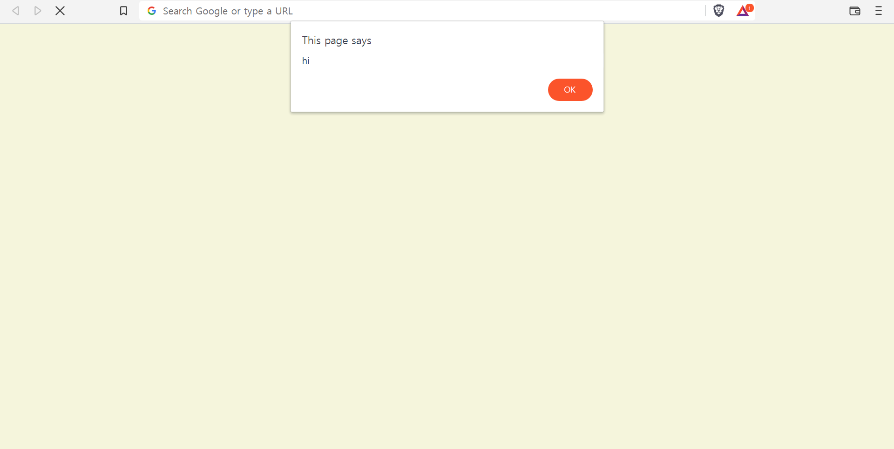
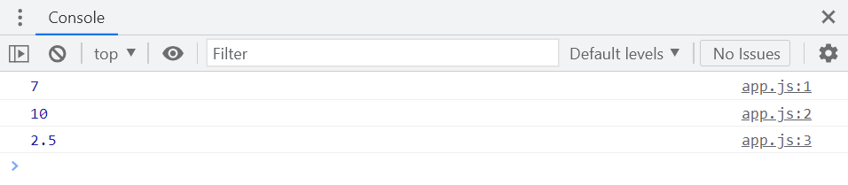
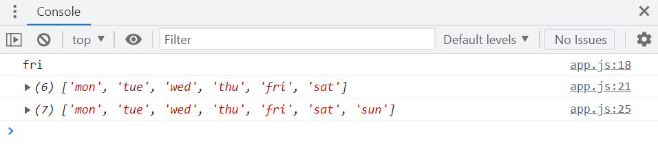
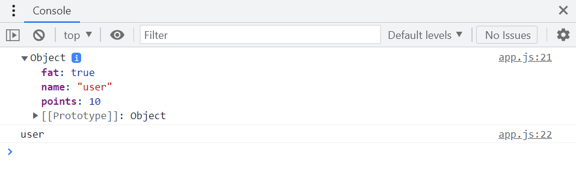
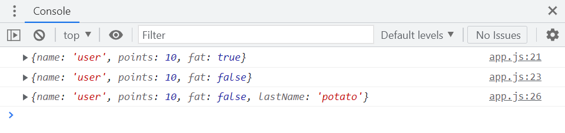

# 자바스크립트 스터디 1주차

> 2022/06/13 ~ 2022/06/19
> 작성자: 김나연

- source: [바닐라 JS로 크롬 앱 만들기](https://nomadcoders.co/javascript-for-beginners/lobby?utm_source=free_course&utm_campaign=javascript-for-beginners&utm_medium=site)

`Javascript` `HTML` `CSS` `VSCode`


## Welcome to Javascript

- 브라우저 `inspect/Console`에서 사용 가능


##### 프로젝트 시작

1. `momentum` 폴더 생성

2.  `index.html`, `style.css`, `app.js` 파일 생성

   ```html
   <!-- index.html -->
   <!DOCTYPE html>
   <html lang="en">
   <head>
   	<meta charset="UTF-8"/>
       <meta http-equiv="X-UA-Compatible" content="IE-edge"/>
       <meta name="viewport" content="width=device-width, initial-scale=1.0"/>
       <link rel="stylesheet" href="style.css"/>
       <title>Momentum</title>
   </head>    
   <body>
       <script src="app.js"></script>
   </body>    
   </html>
   ```

   ```css
   /* style.css */
   body {
       background-color: beige;
   }
   ```

   ```javascript
   // app.js
   alert('hi');
   ```

3. `index.html` 브라우저로 열기 
   
   - `inspect/Elements` ➡ html, css 확인
   - `inspect/Console` ➡ javascript 확인 


##### Basic Data Types

- integer
- float
- string


##### Variables

```javascript
// app.js

// console.log() -> 콘솔에 메시지 전송
console.log(5 + 2);
console.log(5 * 2);
console.log(5 / 2);
```



- `const`: (constant) 바꿀 수 없는 값
    - 새로운 값으로 업데이트할 경우 ➡ 오류 발생
    - ⭐변수를 선언할 때 기본적으로 `const` 사용
    - ⭐변수 이름에 공백이 필요한 경우 ➡ 다음 단어의 첫 문자를 대문자로
   ```javascript
const a = 5;
const b = 2;
const myName = "name";
const veryLongVariableName = 0;

console.log(a + b);
console.log(a * b);
console.log(a / b);
console.log("hello " + myName);
   ```
 
- `let`:  바꿀 수 있는 값
    - 새로운 값으로 업데이트 ⭕
    - 새로운 변수를 생성할 때 한 번만 사용
   ```javascript
let a = 5;
let b = 2;
let myName = "name";

console.log(a + b);
console.log(a * b);
console.log(a / b);
console.log("hello " + myName);

myName = "name1";  // const일 경우, 오류 발생

console.log("your new name is " + myName);
   ```

- `var`: 바꿀 수 있는 값
    - 값을 보호할 수 없음
    - ⭐절대 사용 ❌
    
    
##### Booleans

- `true`, `false` 
    - ex) 사용자 로그인 여부, 비디오 재생 여부, 웹 사이트 로딩 여부

```javascript
const amIFat = false;
console.log(amIFat)
``` 

- `null`: 아무것도 아닌 값

```javascript
const amIFat = null;
console.log(amIFat);
``` 

- `undefined`: 값이 존재하지 않음

```javascript
const amIFat = null;
let something;
console.log(amIFat);
console.log(something);  // undefined
``` 

##### Arrays

```javascript
const mon = "mon";
const tue = "tue";
const wed = "wed";
const thu = "thu";
const fri = "fri";
const sat = "sat";
const sun = "sun";

const daysOfWeek = mon + tue + wed + thu + fri + sat + sun;

console.log(daysOfWeek)  // montuewedthufrisatsun: string
```

- **array**: 무언가를 나열하고 싶을 때 사용 (그룹화)
    - ex) to-do list

```javascript
const mon = "mon";
const tue = "tue";
const wed = "wed";
const thu = "thu";
const fri = "fri";
const sat = "sat";
const sun = "sun";

const daysOfWeek = [mon, tue, wed, thu, fri, sat, sun];

const nonsense = [1, 2, "hello", false, null, true, undefined, "name"];

console.log(daysOfWeek, nonsense);
```


```javascript
const daysOfWeek = ["mon", "tue", "wed", "thu", "fri", "sat"];

// Get item from array
console.log(daysOfWeek[4]);  // 'fri'

// Add one more day to the array
console.log(daysOfWeek);

daysOfWeek.push("sun");

console.log(daysOfWeek);  
```


##### Objects

```javascript
const player = {
    name: "user",
    points: 10,
    fat: true,
};

console.log(player);
console.log(player.name);  // player["name"];
```




- `const` 전체의 값을 바꿀 때 ➡ 오류 발생 ⭕
- `const` 내부의 값을 바꿀 때 ➡ 오류 발생 ❌

```javascript
console.log(player);
player.fat = false;  // 새로운 값으로 업데이트
console.log(player);

player.lastName = "potato"; // 새로운 값 추가
console.log(player);
```

