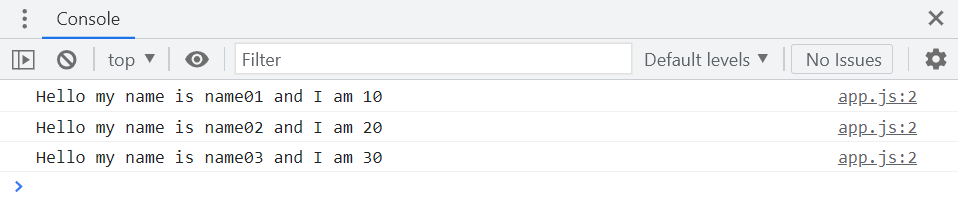
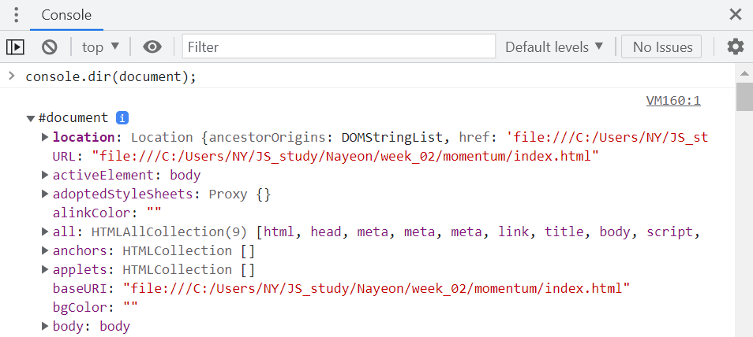
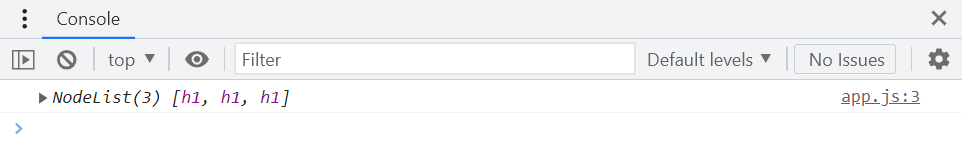

# 자바스크립트 스터디 2주차

> 2022/06/20 ~ 2022/06/26

- 작성자: 김나연
- source: [바닐라 JS로 크롬 앱 만들기](https://nomadcoders.co/javascript-for-beginners/lobby?utm_source=free_course&utm_campaign=javascript-for-beginners&utm_medium=site)

`JavaScript` `HTML` `CSS` `VSCode`


## Welcome to JavaScript

##### Functions

- 반복적으로 사용할 수 있는 코드 조각

```javascript
console.log("Hello my name is name01");
console.log("Hello my name is name02");
console.log("Hello my name is name03");
console.log("Hello my name is name04");
console.log("Hello my name is name05");
```

```javascript
function sayHello(){
    console.log("Hello!");
}

sayHello();
sayHello();
sayHello();
sayHello();
sayHello();
```

- argument (인자): function을 실행하는 동안 어떤 정보를 function에 보낼 수 있는 방법

```javascript
function sayHello(nameOfPerson, age){
    console.log("Hello my name is " + nameOfPerson + " and I am " + age);
}

sayHello("name01", 10);
sayHello("name02", 20);
sayHello("name03", 30);
```




```javascript
function plus(firstNumber, secondNumber){
    console.log(firstNumber + secondNumber);
}
function divide(a, b){
    console.log(a / b);
}

plus();  // NaN: Not a Number
plus(8, 60);  // 86
divide(98, 20);
```

```javascript
const player = {
    name: "name01",
    sayHello: function(otherPersonsName){
        console.log("hello " + otherPersonsName + "nice to meet you!");
    }
};

console.log(player.name);
player.sayHello("name02");
```


##### Returns

- `console.log()`: console에 기록하여 보여줌
- `alert()`: 경고창으로 보여줌

- `return`: 함수의 반환값

```javascript
const calculator = {
    plus: function (a, b) {
        console.log(a + b);
    },
    minus: function (a, b) {
        console.log(a - b);
    },
    times: function (a, b) {
        console.log(a * b)
    },
    divide: function (a, b) {
        console.log(a / b)
    },
    power: function (a, b) {
        console.log(a ** b)
    },
};

console.log(calculator.plus(2, 3));  // undefined
```

```javascript
const age = 96;
function calculateKrAge(ageOfForeigner) {
    return ageOfForeigner + 2;
}

cons krAge = calculateKrAge(age);
console.log(krAge);  // 98
```

```javascript
const calculator = {
    plus: function (a, b) {
        return a + b;
    },
    minus: function (a, b) {
        return a - b;
    },
    times: function (a, b) {
        return a * b
    },
    divide: function (a, b) {
        return a / b;
    },
    power: function (a, b) {
        return a ** b;
    },
};

const plusResult = calculator.plus(2, 3);
const minusResult = calculator.minus(plusResult, 10);
const timesResult = calculator.times(10, minusResult);
const divideResult = calculator.divide(timesResult, plusResult);
const powerResult = calculator.power(divideResult, minusResult);
```


##### Conditionals

```javascript
const age = prompt("How old are you?");

console.log(typeof age, typeof parseInt(age));  
```


- `prompt()`

  - 사용자의 입력값을 받기 위해 사용
  - 아주 오래된 기술

  - CSS 적용할 수 없음
  - 몇몇 브라우저의 경우, 팝업 제한

- `typeof`: 변수 타입 확인
- `parseInt()`: 문자열 ➡ 정수
  - "15" ➡ 15
  - "lalalalala" ➡ NaN


```javascript
const age = parseInt(prompt("How old are you?"));

// isNaN() → boolean
if (isNaN(age)) {
    console.log("Please write a number");
} else {
    console.log("Thank you for writing your age")
}
```


```javascript
const age = parseInt(prompt("How old are you?"));

if (isNaN(age) || age < 0) {
    console.log("Please write a real positive number");
} else if (age < 18) {
    console.log("You are too young");
} else if (age >= 18 && age <= 50) {
    console.log("You can drink");
} else if (age > 50 && age <= 80) {
    console.log("You should exercise");
} else if (age > 80) {
    console.log("You can do whatever you want")
}
```


- `&&`: AND
  - 모든 조건 충족 ➡ **true**
- `||`: OR
  - 조건 중 하나라도 충족 ➡ **true**


## JavaScript on the Browser

##### The Document Object

- `document`: 접근할 수 있는 HTML을 가리키는 객체
- **JavaScript**를 통해 **HTML**을 읽고 수정할 수 있음





##### HTML in JavaScript


```javascript
const title = document.getElementById("title");

title.innerText = "Got you!";
```


##### Searching for Elements

```html
<!DOCTYPE html>
<html lang="en">
<head>
	<meta charset="UTF-8"/>
    <meta http-equiv="X-UA-Compatible" content="IE-edge"/>
    <meta name="viewport" content="width=device-width, initial-scale=1.0"/>
    <link rel="stylesheet" href="style.css"/>
    <title>Momentum</title>
</head>    
<body>
    <h1 class="hello">Grab me!</h1>
    <h1 class="hello">Grab me!</h1>
    <h1 class="hello">Grab me!</h1>
    <h1 class="hello">Grab me!</h1>
    <h1 class="hello">Grab me!</h1>
    <script src="app.js"></script>
</body>    
</html>
```

```javascript
const hellos = document.getElementsByClassName("hello");

console.log(hellos);
```


```html
<!DOCTYPE html>
<html lang="en">
<head>
	<meta charset="UTF-8"/>
    <meta http-equiv="X-UA-Compatible" content="IE-edge"/>
    <meta name="viewport" content="width=device-width, initial-scale=1.0"/>
    <link rel="stylesheet" href="style.css"/>
    <title>Momentum</title>
</head>    
<body>
    <div class="hello">
        <h1>Grab me!</h1>
    </div>
    <script src="app.js"></script>
</body>    
</html>
```

```javascript
const title = document.getElementsByTagName("h1");

console.log(title);
```


- `querySelector`: **CSS** 방식으로 element 검색
  - 첫 번째 값만

```javascript
const title = document.querySelector(".hello h1");

console.log(title);
```


```html
!DOCTYPE html>
<html lang="en">
<head>
	<meta charset="UTF-8"/>
    <meta http-equiv="X-UA-Compatible" content="IE-edge"/>
    <meta name="viewport" content="width=device-width, initial-scale=1.0"/>
    <link rel="stylesheet" href="style.css"/>
    <title>Momentum</title>
</head>    
<body>
    <div class="hello">
        <h1>Grab me!</h1>
    </div>
    <div class="hello">
        <h1>Grab me!</h1>
    </div>
    <div class="hello">
        <h1>Grab me!</h1>
    </div>
    <script src="app.js"></script>
</body>    
</html>
```


- `querySelectorAll`

```javascript
const title = document.querySelectorAll(".hello h1");

console.log(title);
```


