# 자바스크립트 스터디 3주차

> 2022/06/27 ~ 2022/07/03

- 작성자: 김나연
- source: [바닐라 JS로 크롬 앱 만들기](https://nomadcoders.co/javascript-for-beginners)

`JavaScript` `HTML` `CSS` `VSCode`


## JavaScript on the Browser

##### Events

- HTML 

  - `app.js` ➡ `document`로 HTML 접근

  ```html
  <script scr="app.js"></script>
  ```


```javascript
const title = document.querySelector("div.hello:first-child h1");

console.dir(title);

title.style.color = 'blue';
```

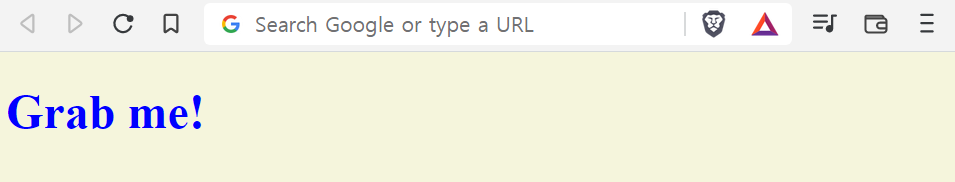


- Event
  - Listen: `addEventListener`
  - ➡ `removeEventListener`


- `click`

```javascript
const title = document.querySelector("div.hello:first-child h1");

function handleTitleClick() {
    console.log("title was clicked!");
}

title.addEventListener("click", handleTitleClick);
```

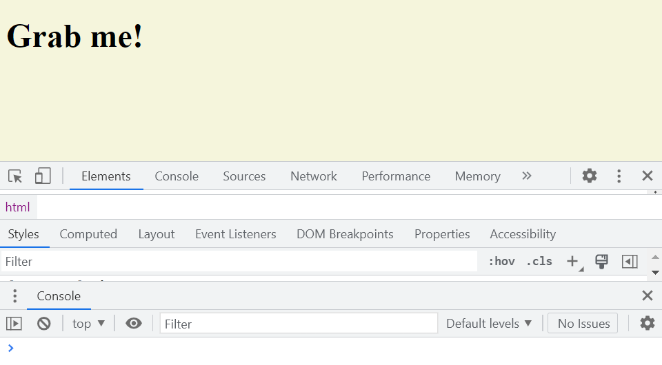

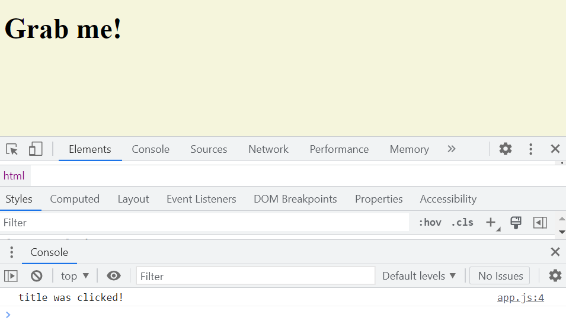

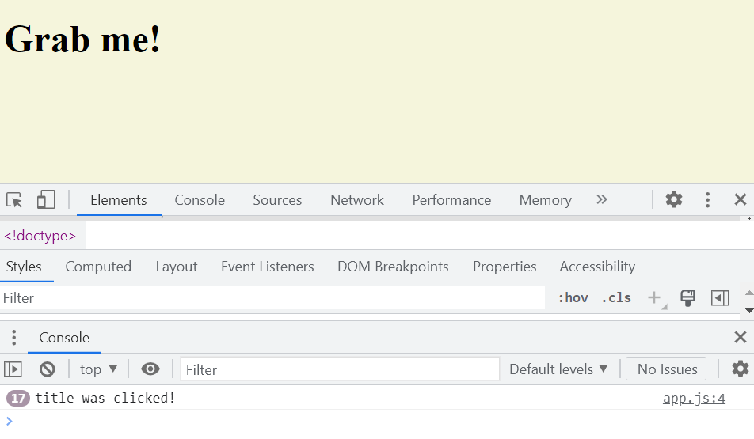


- `mouseenter`

```javascript
const title = document.querySelector("div.hello:first-child h1");

function handleTitleClick() {
    console.log("title was clicked!");
}

function handleMouseEnter() {
    console.log("mouse is here!");
}

title.addEventListener("click", handleTitleClick);
title.addEventListener("mouseenter", handleMouseEnter);
```

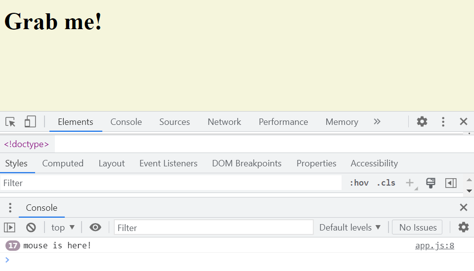


- `mouseleave`

```javascript
const title = document.querySelector("div.hello:first-child h1");

function handleTitleClick() {
    console.log("title was clicked!");
}

function handleMouseEnter() {
    title.innerText = "Mouse is here!"
}

function handleMouseLeave() {
    title.innerText = "Mouse is gone!"
}

title.addEventListener("click", handleTitleClick);
title.addEventListener("mouseenter", handleMouseEnter);
title.addEventListener("mouseleave", handleMouseLeave);
```

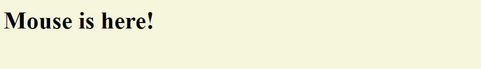

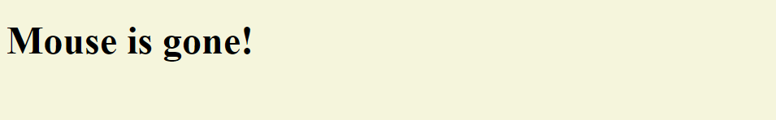


- `addEventListener` 말고 다른 방법으로 이벤트 감지하는 법

```javascript
const title = document.querySelector("div.hello:first-child h1");

function handleTitleClick() {
    console.log("title was clicked!");
}

function handleMouseEnter() {
    title.innerText = "Mouse is here!"
}

function handleMouseLeave() {
    title.innerText = "Mouse is gone!"
}

title.onclick = handleTitleClick;
title.onmouseenter = handleMouseEnter;
title.onmouseleave = handleMouseLeave;
```


- `resize`

```javascript
const h1 = document.querySelector("div.hello:first-child h1");

function handleTitleClick() {
    console.log("title was clicked!");
}

function handleMouseEnter() {
    h1.innerText = "Mouse is here!"
}

function handleMouseLeave() {
    h1.innerText = "Mouse is gone!"
}

function handleWindowResize() {
    document.body.style.backgroundColor = "tomato";
}

h1.addEventListener("click", handleTitleClick);
h1.addEventListener("mouseenter", handleMouseEnter);
h1.addEventListener("mouseleave", handleMouseLeave);

window.addEventListener("resize", handleWindowResize);
```

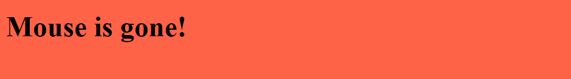


- `copy`

```javascript
const h1 = document.querySelector("div.hello:first-child h1");

function handleTitleClick() {
    console.log("title was clicked!");
}

function handleMouseEnter() {
    h1.innerText = "Mouse is here!"
}

function handleMouseLeave() {
    h1.innerText = "Mouse is gone!"
}

function handleWindowResize() {
    document.body.style.backgroundColor = "tomato";
}

function handleWindowCopy() {
    alert("copier!");
}

h1.addEventListener("click", handleTitleClick);
h1.addEventListener("mouseenter", handleMouseEnter);
h1.addEventListener("mouseleave", handleMouseLeave);

window.addEventListener("resize", handleWindowResize);
window.addEventListener("copy", handleWindowCopy);
```

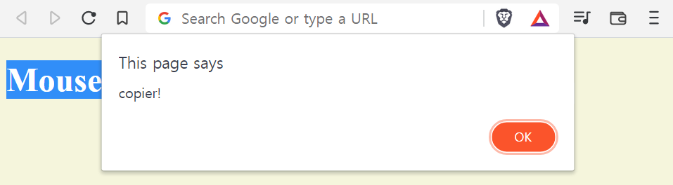


- `online` & `offline`

```javascript
const h1 = document.querySelector("div.hello:first-child h1");

function handleTitleClick() {
    console.log("title was clicked!");
}

function handleMouseEnter() {
    h1.innerText = "Mouse is here!"
}

function handleMouseLeave() {
    h1.innerText = "Mouse is gone!"
}

function handleWindowResize() {
    document.body.style.backgroundColor = "tomato";
}

function handleWindowCopy() {
    alert("copier!");
}

function handleWindowOffline() {
    alert("SOS no WIFI");
}

function handleWindowOnline() {
    alert("ALL GOOD");
}

h1.addEventListener("click", handleTitleClick);
h1.addEventListener("mouseenter", handleMouseEnter);
h1.addEventListener("mouseleave", handleMouseLeave);

window.addEventListener("resize", handleWindowResize);
window.addEventListener("copy", handleWindowCopy);
window.addEventListener("offline", handleWindowOffline);
window.addEventListener("online", handleWindowOnline);
```

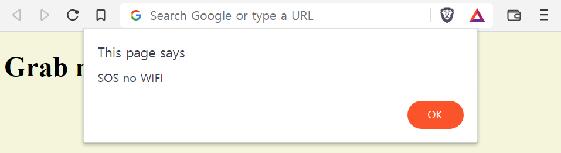

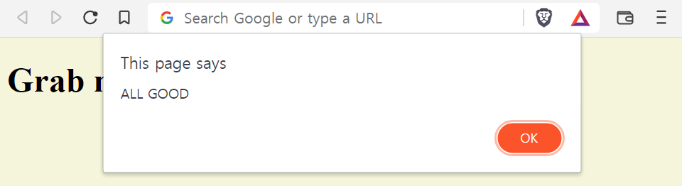


